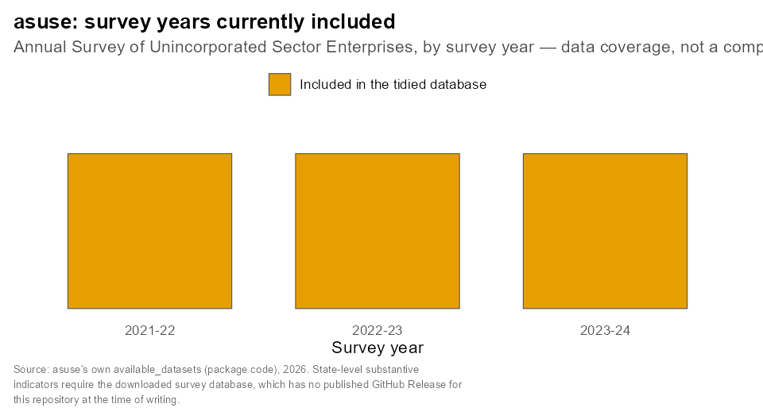

<!-- README.md is generated from README.Rmd. Please edit that file -->
<!-- After editing, regenerate README.md with devtools::build_readme() -->

<!-- badges: start -->
[](https://github.com/rahulsh97/asuse/actions/workflows/R-CMD-check.yaml)
<!-- badges: end -->

```{r, include = FALSE}
knitr::opts_chunk$set(
  collapse = TRUE,
  comment = "#>",
  fig.path = "man/figures/README-",
  out.width = "100%"
)
```

# asuse

asuse is an R package that turns India's Annual Survey of Unincorporated Sector Enterprises (ASUSE) microdata into a single, tidy, queryable database, so you do not have to clean and merge multiple years of survey files yourself before you can start analysing them.

## Who this is for

Researchers, students, and analysts working in R who need ASUSE enterprise-level data on India's unincorporated (informal) non-agricultural sector joined into one place and queryable with ordinary dplyr or SQL code.

## What data this supports

The package currently covers the ASUSE survey years listed in `available_datasets`: 2021-22 through 2023-24. Each year's enterprise-level blocks are included once added to the underlying database.

## What the package does and does not download or redistribute

- The package itself ships **no ASUSE microdata**. It ships only R code, the list of available survey years, and a small amount of public reference material (Indian state boundaries in `region-codes/`) used to work with the data once you have it.
- `asuse_download()` fetches a maintainer-prepared, tidied DuckDB database from this repository's [GitHub Releases](https://github.com/rahulsh97/asuse/releases) and stores it on your own machine, under your R user data directory by default, or under the `ASUSE_PATH` environment variable if you set one. Nothing you do with the package uploads data anywhere.
- The underlying ASUSE microdata is published by the Ministry of Statistics and Programme Implementation (MoSPI) through the [microdata.gov.in](https://microdata.gov.in/NADA/index.php/catalog/238/get-microdata) portal. Review MoSPI's own terms of use before publishing or redistributing derived work, particularly if you extend this package with additional survey years.
- No function in this package requires a login, API key, or other credential.

## Installation

```r
# install.packages("pak")
pak::pak("rahulsh97/asuse")
```

## Quick start

```{r quickstart, eval = FALSE}
library(asuse)

# survey years currently available
available_datasets

# download the tidied database (one-time; the file is large, so this is
# not run automatically when this README is built)
asuse_download()

# path to your local copy of the database
asuse_file_path()
```

## Principal functions

| Function | What it does |
|---|---|
| `available_datasets` | Character vector of the ASUSE survey years currently included in the database (see "What data this supports"). |
| `asuse_download(ver = NULL)` | Downloads the tidied DuckDB database from this repository's GitHub Releases and stores it locally. Skips the download if a matching local copy already exists for your installed DuckDB version. |
| `asuse_file_path(dir = ...)` | Returns the local file path to the DuckDB database, without connecting to it. |
| `asuse_delete(ask = TRUE)` | Deletes the local database directory. Prompts for confirmation unless `ask = FALSE`. |

## Example: querying the database

Once `asuse_download()` has run, the database is a normal DuckDB file you can query with `DBI` or `dplyr`. This example checks the proportion of rural and urban enterprises in the survey (see the [NADA data dictionary](https://microdata.gov.in/NADA/index.php/catalog/238/data-dictionary/F17?file_name=LEVEL%20-%2001(Block%201%20&%20item%201503,%201508%20of%20Block%2015)) for variable codes):

```{r rural_urban_example, eval = FALSE}
library(dplyr)
library(duckdb)

con <- dbConnect(duckdb(), asuse_file_path())

dbListTables(con)

tbl(con, "2023-24-level01") %>%
  count(sector) %>%
  mutate(
    sector = case_when(
      sector == 1L ~ "Rural",
      sector == 2L ~ "Urban",
      TRUE ~ NA_character_
    ),
    pct = n / sum(n)
  ) %>%
  collect()

dbDisconnect(con, shutdown = TRUE)
```

A second example, mapping the proportion of rural enterprises by region, uses the boundary file in `region-codes/`.

## Map geometry

The package includes a boundary layer for India's states and union territories, used for mapping survey results geographically. `region-codes/build_india_map.R` documents how it is built, and `region-codes/MAP_SOURCE.md` has the full source and licence details.

```{r india_map}
library(sf)
library(ggplot2)

india_states <- readRDS("region-codes/india_states_map.rds")

ggplot(india_states) +
  geom_sf(fill = "grey85", colour = "grey40", linewidth = 0.2) +
  theme_minimal(base_size = 13) +
  theme(
    axis.text = element_blank(),
    axis.ticks = element_blank(),
    panel.grid = element_blank(),
    plot.title = element_text(hjust = 0.5, face = "bold")
  ) +
  labs(title = "States and union territories covered by this package")
```

Map geometry: SimpleMaps, used under CC BY 4.0; package-specific data and visualisation by Rahul Shukla. This is a geometry preview, not a statistical indicator: it confirms the boundary layer loads and spans the full country, including the complete northern outline and the island territories.

## Data coverage

```{r data_coverage, echo = FALSE}

```

This chart shows which ASUSE survey years (2021-22 through 2023-24) are currently included in the tidied database, taken directly from the package's own `available_datasets`. It is a coverage inventory, not a computed enterprise indicator: state-level measures such as workers per establishment, enterprise productivity, or the female-owned establishment share require the downloaded survey database via `asuse_download()`, and at the time of writing this repository has no published GitHub Release for that function to fetch. To reproduce or extend this chart once real data is available, adapt `build_data_coverage_chart.R` to compute and map a genuine state-level aggregate instead of a coverage inventory.

## Adding older or newer years

Microdata catalogue: <https://microdata.gov.in/NADA/index.php/catalog/238/get-microdata>

1. Install the Nesstar Explorer (for example, the ASUSE 2023-24 release includes it).
2. Extract the RAR files downloaded from the microdata website to `data-raw/202324`, or whichever year you are adding.
3. Export the `.Nesstar` file to Stata (SAV) format with "Export Datasets", and the metadata with "Export DDI", using the Nesstar Explorer.
4. Update `00-tidy-data.r` and run it.
5. Update the available datasets in `R/available_datasets.R`.
6. Upload the new RDS files to the "Releases" section of the GitHub repository.
7. Regenerate the local database with `asuse_delete()` and `asuse_download()`.

## Relationship to the wider India data ecosystem

asuse is one of a small family of R packages that tidy major Indian government surveys into queryable DuckDB databases using the same design: [asi](https://github.com/rahulsh97/asi) (Annual Survey of Industries, formal manufacturing) and [plfs](https://github.com/rahulsh97/plfs) (Periodic Labour Force Survey, employment and labour). For an overview of these and other public Indian datasets used in economic research, see [india-research-stack](https://github.com/rahulsh97/india-research-stack).

## Contributing and issues

Bug reports and questions are welcome at <https://github.com/rahulsh97/asuse/issues>.

## Citation and licence

Code and the tidying pipeline are released under CC0 1.0 Universal; see [LICENSE.md](LICENSE.md). The underlying ASUSE microdata remains subject to MoSPI's own terms of use.
