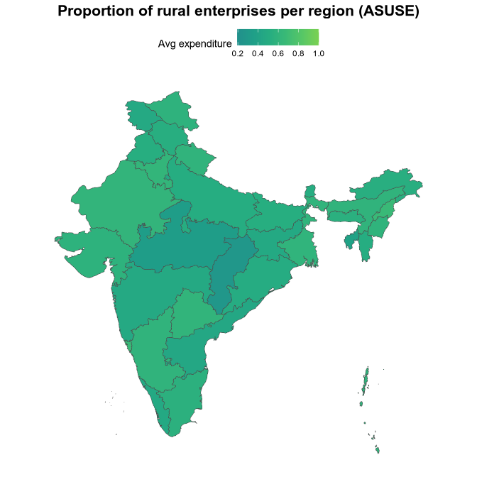

<!-- README.md is generated from README.Rmd. Please edit that file -->

<!-- badges: start -->

[](https://github.com/rahulsh97/asuse/actions/workflows/R-CMD-check.yaml)
<!-- badges: end -->

# Annual Survey of Unincorporated Sector Enterprises (ASUSE)

The goal of asuse is to provide a long dataset of the Annual Survey of
Unincorporated Sector Enterprises (ASUSE) from India.

## Example

Install the package from GitHub and load it:

``` r
# install.packages("devtools")
devtools::install_github("rahulsh97/asuse")
```

``` r
library(asuse)
```

Because of the datasets size, the package provides a function to
download the datasets and create a local DuckDB database. This results
in a CRAN-compliant package.

Here is how to get the ASUSE database ready for use:

``` r
asuse_download()
```

Check the proportion of rural and urban companies in the survey (See
<https://microdata.gov.in/NADA/index.php/catalog/238/data-dictionary/F17?file_name=LEVEL%20-%2001(Block%201%20&%20item%201503,%201508%20of%20Block%2015>)):

``` r
library(dplyr)
#> 
#> Attaching package: 'dplyr'
#> The following objects are masked from 'package:stats':
#> 
#>     filter, lag
#> The following objects are masked from 'package:base':
#> 
#>     intersect, setdiff, setequal, union
library(duckdb)
#> Loading required package: DBI

con <- dbConnect(duckdb(), asuse_file_path())

dbListTables(con)
#>  [1] "2021-22-level01" "2021-22-level02" "2021-22-level03" "2021-22-level04"
#>  [5] "2021-22-level05" "2021-22-level06" "2021-22-level07" "2021-22-level08"
#>  [9] "2021-22-level09" "2021-22-level10" "2021-22-level11" "2021-22-level12"
#> [13] "2021-22-level13" "2021-22-level14" "2021-22-level15" "2021-22-level16"
#> [17] "2022-23-level01" "2022-23-level02" "2022-23-level03" "2022-23-level04"
#> [21] "2022-23-level05" "2022-23-level06" "2022-23-level07" "2022-23-level08"
#> [25] "2022-23-level09" "2022-23-level10" "2022-23-level11" "2022-23-level12"
#> [29] "2022-23-level13" "2022-23-level14" "2022-23-level15" "2022-23-level16"
#> [33] "2023-24-level01" "2023-24-level02" "2023-24-level03" "2023-24-level04"
#> [37] "2023-24-level05" "2023-24-level06" "2023-24-level07" "2023-24-level08"
#> [41] "2023-24-level09" "2023-24-level10" "2023-24-level11" "2023-24-level12"
#> [45] "2023-24-level13" "2023-24-level14" "2023-24-level15" "2023-24-level16"

tbl(con, "2023-24-level01") %>%
  distinct(district) %>%
  arrange() %>%
  pull()
#>  [1] "21" "17" "16" "02" "24" "70" "42" "61" "63" "46" "56" "66" "45" "36" "37"
#> [16] "11" "13" "29" "30" "60" "48" "53" "57" "58" "41" "39" "52" "38" "05" "19"
#> [31] "10" "27" "71" "54" "75" "67" "34" "07" "22" "18" "12" "26" "73" "47" "59"
#> [46] "68" "74" "01" "08" "03" "25" "65" "69" "40" "51" "06" "15" "32" "31" "62"
#> [61] "55" "72" "20" "09" "04" "64" "50" "35" "14" "28" "33" "23" "43" "44" "49"

tbl(con, "2023-24-level01") %>%
  count(sector) %>%
  mutate(
    sector = case_when(
      sector == 1L ~ "Rural",
      sector == 2L ~ "Urban",
      TRUE ~ NA_character_
    ),
    pct = n / sum(n)
  ) %>%
  collect()
#> Warning: Missing values are always removed in SQL aggregation functions.
#> Use `na.rm = TRUE` to silence this warning
#> This warning is displayed once every 8 hours.
#> # A tibble: 2 × 3
#>   sector      n   pct
#>   <chr>   <dbl> <dbl>
#> 1 Rural  283448 0.528
#> 2 Urban  253751 0.472

dbDisconnect(con, shutdown = TRUE)
```

Create a map showing the proportion of rural companies per region:

``` r
library(sf)
#> Linking to GEOS 3.13.1, GDAL 3.11.3, PROJ 9.6.0; sf_use_s2() is TRUE
library(stringr)
library(ggplot2)

con <- dbConnect(duckdb(), asuse_file_path())

dbListTables(con)
#>  [1] "2021-22-level01" "2021-22-level02" "2021-22-level03" "2021-22-level04"
#>  [5] "2021-22-level05" "2021-22-level06" "2021-22-level07" "2021-22-level08"
#>  [9] "2021-22-level09" "2021-22-level10" "2021-22-level11" "2021-22-level12"
#> [13] "2021-22-level13" "2021-22-level14" "2021-22-level15" "2021-22-level16"
#> [17] "2022-23-level01" "2022-23-level02" "2022-23-level03" "2022-23-level04"
#> [21] "2022-23-level05" "2022-23-level06" "2022-23-level07" "2022-23-level08"
#> [25] "2022-23-level09" "2022-23-level10" "2022-23-level11" "2022-23-level12"
#> [29] "2022-23-level13" "2022-23-level14" "2022-23-level15" "2022-23-level16"
#> [33] "2023-24-level01" "2023-24-level02" "2023-24-level03" "2023-24-level04"
#> [37] "2023-24-level05" "2023-24-level06" "2023-24-level07" "2023-24-level08"
#> [41] "2023-24-level09" "2023-24-level10" "2023-24-level11" "2023-24-level12"
#> [45] "2023-24-level13" "2023-24-level14" "2023-24-level15" "2023-24-level16"

# average day of manufacturing days per region
# README_ASUSE_2324%20.pdf: the State code can be derived from the field ‘NSS-Region’ (first 2 digits) 
mean_rural <- tbl(con, "2023-24-level01") %>%
  mutate(
    sector = case_when(
      sector == 1L ~ "Rural",
      sector == 2L ~ "Urban",
      TRUE ~ NA_character_
    )
  ) %>%
  mutate(
    nss_region = as.integer(substr(district, 1, 2))
  ) %>%
  count(nss_region, sector) %>%
  group_by(nss_region) %>%
  mutate(pct = n / sum(n)) %>%
  filter(sector == "Rural") %>%
  collect()

dbDisconnect(con, shutdown = TRUE)

# merge data with map of India states

india_states <- readRDS("region-codes/india_states_map.rds")

mean_rural <- mean_rural %>%
  mutate(nss_region = str_pad(nss_region, width = 2, side = "left", pad = "0")) %>%
  left_join(india_states, by = c("nss_region" = "state_code"))

ggplot(mean_rural) +
  geom_sf(aes(fill = pct, geometry = geometry), colour = "grey30", size = 0.2) +
  scale_fill_viridis_c(option = "D", begin = 0.5, end = 0.8, na.value = "grey95", name = "Avg expenditure") +
  labs(title = "Proportion of rural enterprises per region (ASUSE)") +
  theme_minimal() +
  theme(
    axis.text = element_blank(),
    axis.ticks = element_blank(),
    panel.grid = element_blank(),
    plot.title = element_text(hjust = 0.5, size = 16, face = "bold"),
    legend.position = "top"
  )
```



# Adding older/newer years

Microdata:
<https://microdata.gov.in/NADA/index.php/catalog/238/get-microdata>

1.  Install the Nesstar Explorer (e.g. ASUSE 2023-24 includes it)
2.  Extract the RAR files downloaded from the microdata website to
    data-raw/202324 or what year you are adding
3.  Export the .Nesstar file to Stata (SAV) format with “Export
    Datasets” and the metadata with “Export DDI” using the Nesstar
    Explorer
4.  Update `00-tidy-data.r` and run it
5.  Update the available datasets in `R/available_datasets.R`
6.  Update the new RDS files in the ‘Releases’ section of the GitHub
    repository
7.  Regenerate the database with `asuse_delete()` and `asuse_download()`
